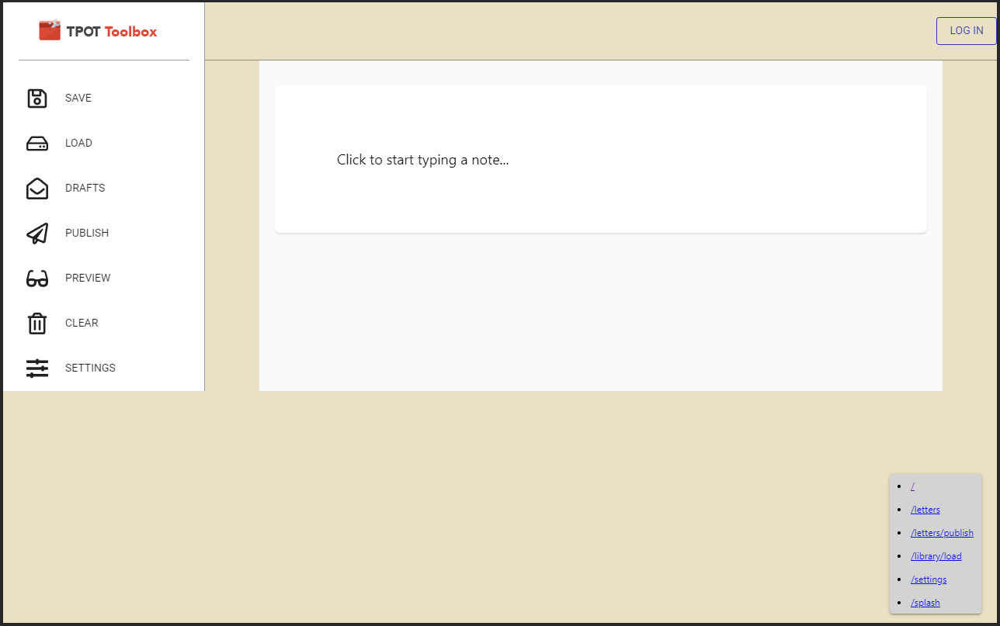
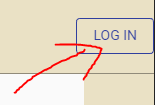
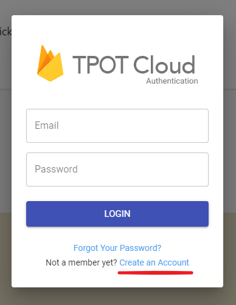
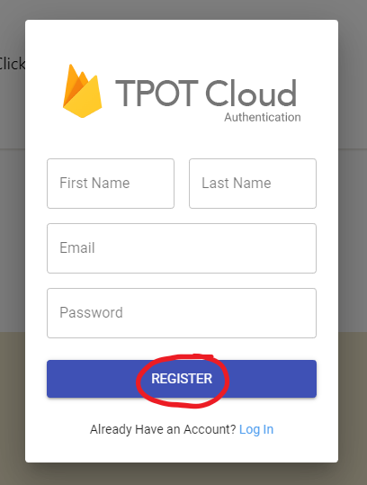
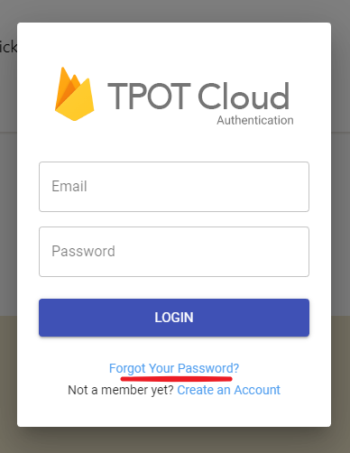
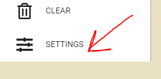

  <h1>
    TPOT Toolbox
  </h1>

  

# Getting Started

- [__What Is This App?__](#what-is-this-app)
- [__How to Use Toolbox__](#how-to-use-toolbox)
    - [Create a TPOT Cloud Account](#create-a-tpot-cloud-account)
    - [Reset Your Password](#reset-your-password)
    - [Adjusting Your Settings](#adjusting-your-settings)
- [__App Specific Guides__](#app-specific-guides)
    - [__Letters__](#Letters)
- __Using Toolbox Offline__ (coming soon)
- [__What's New?__](#whats-new)

# What Is This App?

TPOT Toolbox is a web-based tool that hosts a variety of smaller apps that can be used to help accomplish tasks for [ThePathOfTruth](). 

Because TPOT Toolbox lives on the web, it means that you can access it from not only your desktop, but your [tablet]() and [smartphone]() as well. Recently websites now have the ability to be installed for offline use on your device. We will be adding this feature [very soon]().

Next, lets learn [how to use it](#how-to-use-toolbox).

##### [Return to Getting Started](#getting-started)

# How to Use Toolbox

    <a href="https://www.thepathoftruth.com">
            <h2>https://tpot.netlify.com</h2>
    </a>

Toolbox is a website based app you can visit. Go to [https://tpot.netlify.com](https://tpot.netlify.com) in your web browser to see Toolbox!

    

## Create a TPOT Cloud Account

Some of the apps in Toolbox have access to sensative information. In order to use these apps, you will need to create an account and be approved by an admin to use these services, such as the Letters program, which posts content to the ThePathOfTruth website.

There are other apps that you can use that don't require sign in, such as the email sorter.

> __Lets Create an Account:__
   
1) In the top right corner, click __[`LOG IN`]()__

2) Click __[`Create an Account`]()__

3) Enter your account information, then click __[`Register`]()__

> At this point your account was created. You can click on the Login button again to sign in to your account. When you do, your email  and or name should appear in the top toolbar. You can add a profile picture later in Settings. See [adjusting your settings](#adjusting-your-settings) for more info.

> Certain apps like Letters may  require admin approval before you are allowed to use them. Be patient and we will get back with you.

## Reset Your Password

If you ever forget or want to change your password outside of Settings, click on the Login button again and this time, click __[`Forgot Your Password?`]()__

You will receive an email with a link to another wepage where you can reset your password. If you don't recieve a password reset email within 2 minutes,  check your spam folder!

## Adjusting Your Settings

In the left sidebar, click  __[`Settings`]()__ or the icon with sliders on it.

From here you can adjust global settings for Toolbox, or adjust settings for smaller apps like Letters. You can also personalize Toolbox to your liking by uploading a profile picture, selecting color themes, and other tweaks. More to come soon!

##### [Return to Getting Started](#getting-started)

# Letters

> The following instructions will help new users get familiar with TPOT Toolbox's Letters App:

## Sign In

First thing's first, you must sign in or register with your email and password.  If you are not registered or forgot your password yet, that's ok.  See [creating a TPOT Cloud Account](Ecreate-a-tpot-cloud-account).

Once you are signed in, you can start using Letters. Here is how:

## Typing Text

## Loading a File
Or, you can load an existing letter or paper from your local disk:

## Setting Quotes

## Adding a Line Break

## Adding Bullets

## Adding Emphases

## Adding Colors

## Aligning Text

## Adding Links

# What's New?

__6/29/19 - Installing on Mobile Devices__

In conjunction with offline support, we are going to add the ability to install Toolbox on your tablet and smartphone. Internally, we were able to get Toolbox to work on the Surface Pro 3, and iPad, the  Raspberry Pi 3, and a few Android smartphones.

While we can install Toolbox on these devices, we still have to re-build the user interface to work on smaller screens. This means not all apps in Toolbox will work right away as a mobile-version of the app. Please be patient while we work all this out. (There is only one person who works on the user interface!)

---

__6/08/19 - Offline Support__

We have been working on getting Toolbox available for offline support, which means you can use Toolbox without an internet connection for most of its task. When you are able to reconnect, then you can upload the files you were working on.

---

## Publishing a New Letter or Paper

